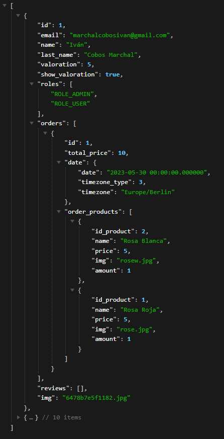

# Backend Doc

The backend part of this project has been done with symfony, although is only to make a controller for the API and create, update, get and delete things on the database.

# Table of Contents

- [Creation of the proyect](#creation-of-the-proyect)
- [Creation of the API and config](#creation-of-the-API-and-config)
  - [Creation of a service](#creation-of-a-service)
  - [CORS Config](#cors-config)

# Creation of the proyect

First of all we gonna create a new symfony proyect for the backend

```php
symfony new back --webapp
```

# Creation of the API and config

We should start creating a new controller for the API

```powershell
php bin/console make:controller
```

Here we gonna strat making the routes for this API to work, something like this:

```php
    #[Route('/api')]
    class ApiController extends AbstractController
    {
        // Devuelve todos los datos de todos los usuarios
        #[Route('/data', name: 'app_api_data', methods:["GET"])]
        public function usersIndex(Request $request,UserRepository $userRepository, Apiformatter $apiFormatter):        JsonResponse
        {
            $users = $userRepository->findAll();
            $usersJSON = [];

            foreach($users as $user) {
                $usersJSON[] = $apiFormatter->data($user);
            }
            return new JsonResponse($usersJSON);
        }
    }
```

## Creation of a service

We are using a service in the folder **back/src/Service** here we format the API data as an array to make it posible the export as a JsonResponse.

```php
<?php
namespace App\Service;

class ApiFormatter
{
      // Api con datos de todos los usuarios
    public function data($user): array
    {
        $userJSON=[];
        $orders = [];
        $reviews = [];
        foreach ($user->getOrders() as $order) {
            $obj = new \stdClass();
            $obj -> id = $order->getId();
            $obj -> total_price = $order->getTotal();
            $obj -> date = $order->getDate();
            foreach ($order->getOrderProducts() as $orderproduct) {
                $obj2 = new \stdClass();
                // $obj2 -> id = $orderproduct->getId();
                $obj2 -> id_product = $orderproduct->getProduct()->getId();
                $obj2 -> name = $orderproduct->getProduct()->getName();
                $obj2 -> price = $orderproduct->getProduct()->getPrice();
                $obj2 -> img = $orderproduct->getProduct()->getImg();
                $obj2 -> amount = $orderproduct->getAmount();
                $orders_product[]=($obj2);
            }
            $obj -> order_products = $orders_product;
            $orders[]=($obj);
        }

        foreach ($user->getReviews() as $review) {

            $obj = new \stdClass();
            $obj -> text = $review->getText();
            $obj -> valoration = $review->getValoration();
            $reviews[]=($obj);
        }

        $userJSON = array(
        'id' => $user->getId(),
        'email' => $user->getEmail(),
        'name' => $user->getName(),
        'last_name' => $user->getLastName(),
        'valoration' => $user->getValoration(),
        'show_valoration' => $user->isShowValoration(),
        'roles' => $user->getRoles(),
        'orders' => $orders,
        'reviews' => $reviews,
        'img' => $user->getImg(),
    );
    return $userJSON;
    }
}
```

The result is that we have all the data on the API at that route of the controller, one image is better for you 😀



## CORS Config

We are going to use the **"nelmio/cors-bundle"**, we install it:

```powershell
composer require nelmio/cors-bundle
```

We can prove that it is installed by going to the **"config/bundles.php"**

```php
return [
    // ...
    Nelmio\CorsBundle\NelmioCorsBundle::class => ['all' => true],
];
```
The next and final step, we need to change this file content **"config/packages/nelmios_cors.yaml"**, it should end like this:

```yaml
# nelmio_cors:
#     defaults:
#         origin_regex: true
#         allow_origin: ['%env(CORS_ALLOW_ORIGIN)%']
#         allow_methods: ['GET', 'OPTIONS', 'POST', 'PUT', 'PATCH', 'DELETE']
#         allow_headers: ['Content-Type', 'Authorization']
#         expose_headers: ['Link']
#         max_age: 3600
#     paths:
#         '^/': null
nelmio_cors:
    defaults:
        allow_credentials: false
        allow_origin: ['*']
        allow_headers: ['*']
        allow_methods: ['GET', 'POST', 'PUT', 'DELETE']
        expose_headers: []
        max_age: 0
    paths:
        '^/api/':
            allow_origin: ['*']
            allow_headers: ['*']
            allow_methods: ['GET', 'POST', 'PUT', 'DELETE']
            max_age: 3600
```
The rest for the backend part is simple, just create your database and create entitties, change or create some methods on the repository, you know, basic symfony...   